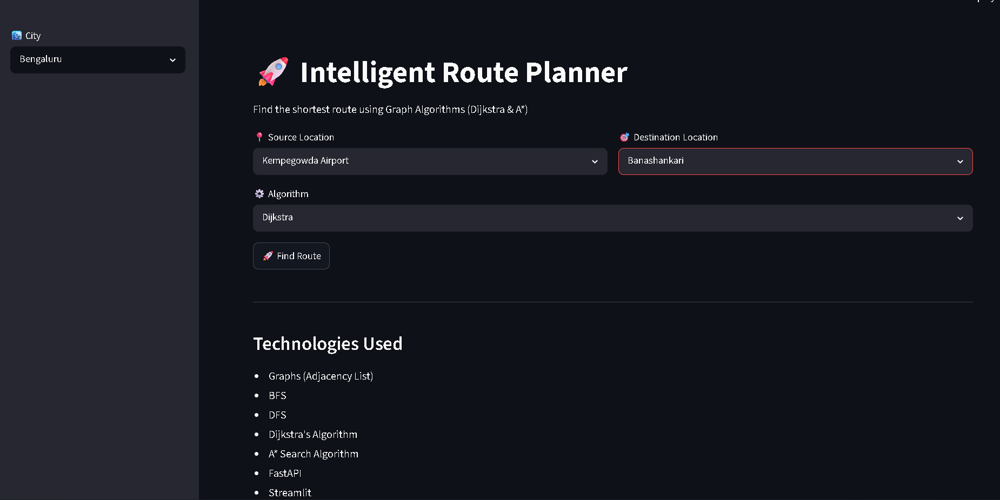
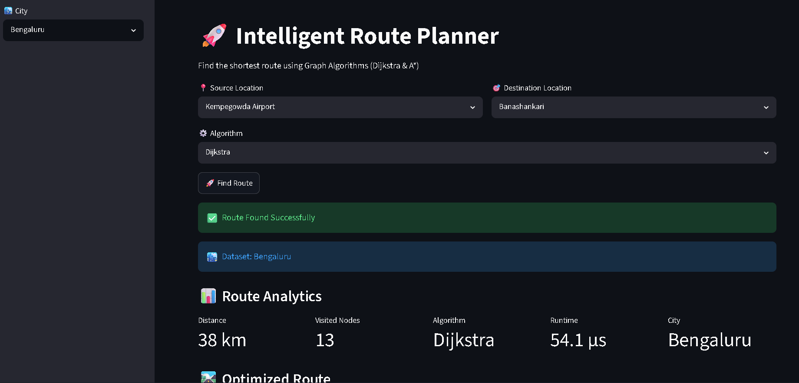
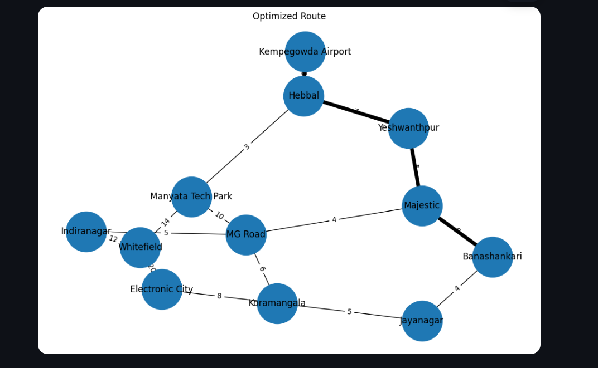
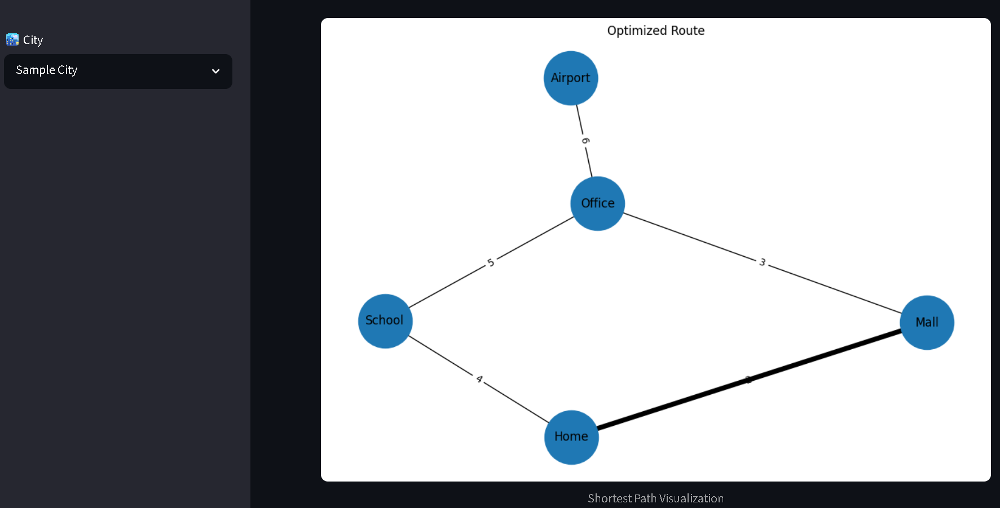
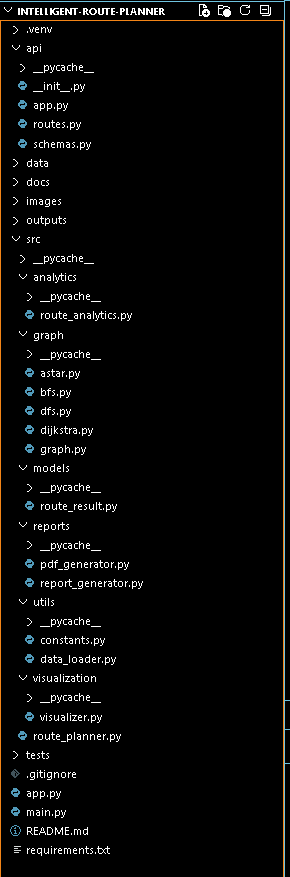

# 🚀 Intelligent Route Planner

### Multi-City Route Optimization using Graph Algorithms (Dijkstra & A*)


---

## 📌 Overview

Intelligent Route Planner is a graph-based route optimization system that calculates the shortest path between locations using Dijkstra's Algorithm and A* Search Algorithm.

The project demonstrates practical implementation of:

- Graph Data Structures
- Adjacency Lists
- Dijkstra's Algorithm
- A* Search Algorithm
- Route Visualization
- FastAPI Backend Development
- Streamlit Frontend Development
- Cloud Deployment

Users can select locations from multiple city datasets and compare route optimization performance across different algorithms.

---

## 🌐 Live Demo

### Frontend (Streamlit)

https://intelligent-route-planner-ha4h6vhb2lkm3aoakvgofj.streamlit.app/

### Backend API

https://intelligent-route-planner-api.onrender.com/

### Swagger Documentation

https://intelligent-route-planner-api.onrender.com/docs

### GitHub Repository

https://github.com/Vayu-143/intelligent-route-planner

---

## ✨ Features

### Route Optimization
- Shortest path calculation
- Multi-city support
- Weighted graph routing
- Real-time route analytics

### Algorithms Implemented

#### Dijkstra's Algorithm
- Guarantees shortest path
- Suitable for weighted graphs
- Complete graph traversal

#### A* Search Algorithm
- Heuristic-based optimization
- Faster route discovery
- Reduced node exploration

### Visualization
- Dynamic graph visualization using NetworkX
- Highlighted shortest route
- Edge weight display
- Route image generation

### Reports
- PDF route reports
- Text-based route summaries
- Execution analytics

### API Features
- RESTful architecture
- Swagger documentation
- Health monitoring endpoint
- City-specific route planning

---

## 🏗️ System Architecture

```text
User
 │
 ▼
Streamlit Frontend
 │
 ▼
FastAPI Backend
 │
 ├── Dijkstra Algorithm
 ├── A* Algorithm
 ├── Route Analytics
 ├── PDF Report Generator
 └── Graph Visualizer
 │
 ▼
Graph Dataset
 │
 ▼
Optimized Route Result
```

---

## 🧠 Data Structures & Algorithms

### Graph Representation

Adjacency List

Example:

```text
Home
 ├── Mall (2)
 └── School (4)

Mall
 └── Office (3)

School
 └── Office (5)
```

### Time Complexity

| Algorithm | Complexity |
|------------|------------|
| BFS | O(V + E) |
| DFS | O(V + E) |
| Dijkstra | O((V + E) log V) |
| A* Search | O(E) – O(V log V) |

---

## 📊 Route Analytics

The application provides:

- Total Distance
- Execution Time
- Visited Nodes
- Selected Algorithm
- Source & Destination
- Route Path

Example:

```text
Source: Kempegowda Airport
Destination: Banashankari

Route:
Airport → Hebbal → Yeshwanthpur → Majestic → Banashankari

Distance:
25 km

Algorithm:
A*
```

---

## 📁 Project Structure

```text
intelligent-route-planner/
│
├── api/
│   ├── app.py
│   └── schemas.py
│
├── data/
│   ├── city_graph.json
│   ├── bengaluru_graph.json
│   └── sample_coordinates.json
│
├── src/
│   ├── analytics/
│   ├── graph/
│   ├── models/
│   ├── reports/
│   ├── utils/
│   └── visualization/
│
├── outputs/
│
├── docs/
│   ├── architecture.md
│   └── algorithm_notes.md
│
├── streamlit_app.py
├── requirements.txt
└── README.md
```

---

## ⚙️ Installation

### Clone Repository

```bash
git clone https://github.com/Vayu-143/intelligent-route-planner.git

cd intelligent-route-planner
```

### Create Virtual Environment

```bash
python -m venv .venv
```

### Activate Environment

Windows:

```bash
.venv\Scripts\activate
```

Linux/Mac:

```bash
source .venv/bin/activate
```

### Install Dependencies

```bash
pip install -r requirements.txt
```

---

## ▶️ Run FastAPI

```bash
uvicorn api.app:app --reload
```

Swagger:

```text
http://127.0.0.1:8000/docs
```

---

## ▶️ Run Streamlit

```bash
streamlit run streamlit_app.py
```

---

## 📸 Screenshots

### 🏠 Homepage



---

### 📊 Route Analytics



---

### 🗺️ Route Visualization



---

### 🏙️ Sample City Route



---

### 📚 API Documentation (Swagger)


---

### 🏗️ Project Structure



## 🔌 API Endpoints

| Endpoint | Method | Description |
|-----------|---------|-------------|
| / | GET | Home |
| /health | GET | Health Check |
| /cities | GET | Available Cities |
| /locations/{city} | GET | City Locations |
| /dijkstra | POST | Dijkstra Route |
| /astar | POST | A* Route |
| /visualization | GET | Route Visualization |
| /report | GET | PDF Report |

---

## 🛠️ Technologies Used

### Backend
- Python
- FastAPI
- Uvicorn

### Frontend
- Streamlit

### Visualization
- NetworkX
- Matplotlib

### Reports
- ReportLab

### Deployment
- Render
- Streamlit Cloud
- GitHub

---

## 📈 Future Enhancements

- Google Maps Integration
- Live Traffic Data
- Multi-stop Route Optimization
- Distance Matrix Support
- Vehicle Routing Problem (VRP)
- GIS Mapping Support
- Real-Time Route Updates

---

## 👨‍💻 Author

**Vayunandan Mishra**

B.Tech Student | Python Developer | DSA Enthusiast

GitHub: https://github.com/Vayu-143

---

## 📜 License

This project is developed for educational and portfolio purposes.

© 2026 Vayunandan Mishra. All Rights Reserved.